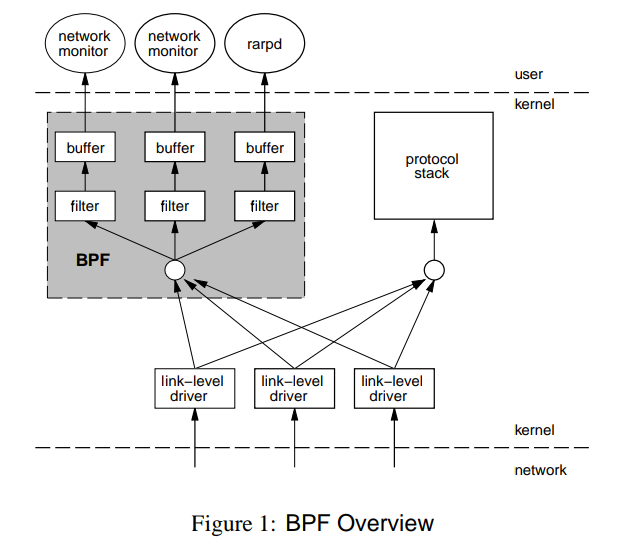

## 前言

本文会对 eBPF 技术进行初步的介绍，包括基本原理，相关基础设施以及主要的应用场景，帮助读者对 eBPF 技术有一个总体的认识，了解涉及的众多概念，方便后续需要深入了解时知道要查找什么内容。

## 背景

### BPF

BPF (Berkeley Packet Filter) 是类 Unix 系统上数据链路层的一种原始接口，提供原始链路层封包的收发。Linux 内核采用 BPF 作为网络数据包过滤技术。
包括像 tcpdump 的底层也是采用 BPF 作为底层包过滤技术。

### eBPF

> eBPF 是一项革命性技术，它能在内核中运行沙箱程序（sandbox programs），而无需修改内核源码或者加载内核模块。

eBPF (extended Berkeley Packet Filter) 是在 BPF 基础上经过重新设计，逐步演进为一个通用执行引擎，允许用户在操作系统的内核中加载和运行自定义程序，可用于扩展甚至修改内核行为。

eBPF 最早出现在 3.18 内核版本中，此后原来的 BPF 就被称为经典 BPF，缩写为 cBPF（classic BPF）。

### Why eBPF

Linux 内核的主要作用是管理硬件或虚拟硬件，并提供一致的 API（系统调用），以实现应用程序运行和共享资源。Linux 划分了一组子系统来分别管理。每个子系统一般在一定程度上都提供了可配置的功能，来满足用户的不同需求。如果满足不了需求，则需要对内核进行更改，可以通过直接修改子系统或者编写一个内核模块两种方式，但都存在痛点：

* 直接给对应子系统提交 Patch：
  * 需要说服 Linux 内核社区相信更改是有必要的
  * 新的内核版本一般需要几年时间才能够商用
* 编写一个内核模块：
  * 需要定期修复内核模块，因为每个内核版本都可能损坏该模块
  * 缺乏安全边界，可能会损坏 Linux 内核

而使用 eBPF，可以使用一种新方法来重新对内核行为进行编程，而无需更改内核源码或者加载内核模块。

## 基本概念和原理

### Hook（钩子）

eBPF 程序是事件驱动的，当内核或应用程序执行到某个钩子时运行。预定义的钩子包括系统调用，函数进入/退出，内核跟踪点，网络事件等。如果预定义的钩子不满足需求，可以创建 kprobe 或 uprobe 来作为自定义钩子触发 ePBF 程序。

### 编写 eBPF 程序

一般是通过编写高级编程语言（C）或者一些 eBPF 项目（bcc，bpftrace）提供的命令工具，将高级语言转换成 eBPF 字节码的形式。

### Loader

通过 eBPF 库或者直接使用 bpf 系统调用将 eBPF 程序加载到 Linux 内核时，要经历 vertification（验证）和 JIT Compilation（即时编译）两个步骤才能被附加到请求的钩子上。

验证步骤确保 eBPF 程序可以安全地运行，它主要验证以下条件：
* 加载 eBPF 程序的进程拥有所需的功能权限
* 程序不会崩溃
* 程序没有死循环

即时编译步骤将 eBPF 字节码转换为机器特定指令集，来优化程序的执行速度。

### Maps

eBPF 程序可以使用 eBPF maps 来存储和查询数据，map 可以通过 eBPF 程序访问，也能通过系统调用从用户态程序中访问。

map 支持多种数据类型，并且每种数据类型都有共享和线程独有两种。支持的数据类型例如：
* Hash tables, Arrays
* LRU
* Ring Buffer
* Stack Trace
* ...

### Helper Calls

为了程序兼容性考虑，eBPF 程序不能随意调用内核函数。相对的，内核提供了一组稳定的 API 供 eBPF 程序调用。例如：
* 生成随机数
* 获取当前时间和日期
* 读写 eBPF map
* 获取进程上下文
* 处理网络数据包及转发逻辑

### Tail & Function Calls

eBPF 程序中除了可以定义和调用函数，还可以使用 Tail Call（尾部调用）来调用和执行另一个 eBPF 程序，并替换执行上下文，与 exec 系统调用对进程的处理类似。

## 基础设施

### eBPF Runtime

Linux 内核中实现了 eBPF Runtime（运行时）来执行 eBPF 程序。用户程序可以通过 bpf 系统调用来设置 eBPF 程序执行的内容以及时机。内核会使用 eBPF verifier 来检查 eBPF 程序的安全性，通过后 JIT compiler 就将程序翻译成可执行的机器码。

### Compiler eBPF Backend

直接编写 eBPF 指令码跟编写汇编代码一样繁琐，因此 LLVM 和 GCC 编译器都提供了生成 eBPF 指令码的功能，现在用户可以通过编写 C 程序来使用 eBPF 功能。

LLVM 编译器包含了 eBPF 后端，它会生成包含程序码，重定位等信息的 eBPF ELF 文件，这些文件可以被 eBPF loader 分析并加载到内核中。

GCC 编译器从 10 开始支持 eBPF 后端，在此之前 LLVM 是唯一的选择。目前对 eBPF 特性的支持上已经和 LLVM 差不多了。

### Development Toolchains

#### bcc

[bcc][3] 是一个编程框架，用户通过它可以实现编写 python 代码来进行 eBPF 编程。该框架主要适用于需要对应用程序和系统进行分析和追踪的场景。通常 eBPF 程序用于收集统计数据或者生成对应事件，然后由用户态程序统一处理并以人类可读的方式进行展示。python 程序将生成 eBPF 字节码并加载到内核中。

#### bpftrace

[bpftrace][5] 是 eBPF 编程使用的高级追踪语言，它使用 LLVM 作为后端，将脚本编译成 eBPF 字节码，并使用 bcc 与 Linux eBPF 子系统以及像 kprobes，uprobes，tracepoints 这些现有的 Linux 追踪功能进行交互。

#### eBPF Libraries

目前支持 eBPF Libraries 的语言主要由 C/C++，Rust 和 Golang。下面列举了这三种语言主流的库。

* C/C++
  * [libbpf][20]
  * [libxdp][21]
* Rust
  * [libbpf-rs][22]
  * [redbpf][23]
  * [aya][24]
* Golang
  * [ebpf][25]
  * [libbpfgo][26]

libbpf 是一个基于 C/C++ 的库，属于 Linux 内核上游的一部分。它包含一个 eBPF loader，它会处理 LLVM 生成的 eBPF ELF 文件，以便加载到内核中。与 BCC 相比，其功能和复杂性有很大的提升，还支持如全局变量，BPF 框架等特性。而 libbpf-rs 和 libbpfgo 都是对 libbpf 的一层封装，分别适用于 Rust 和 Go 语言。

#### 其他

除上述提到的项目外，还有一些值得关注的新兴内容：

* [eBPF for Windows][27]：让 eBPF 生态中熟悉的工具和 API 能在 Windows 系统上运行
* [uBPF][28] 用户态 eBPF 运行时
* [rbpf][29] 用户态 eBPF 运行时
* [hBPF][30] 硬件方面的 eBPF

## 应用场景

目前 eBPF 技术主要应用于 Networking（网络）、Security（安全）、Observability & Tracing（观测监控和追踪）这几个领域。下面列出了各个领域方向比较知名的一些项目。

领域 | 项目
--- | ---
Networking | [Cilium][4]，[Katran][7]，[pwru][15]，[Merbridge][18]
Security | [Falco][6]，[Tracee][12]，[KubeArmor][17]
Observability & Tracing | [Pixie][8]，[Pyroscope][9]，[Parca][10]，[Hubble][11]，[Tetragon][13]，[kubectl trace][14]，[Inspektor Gadget][16]，[Apache SkyWalking][19]

上述这些项目大部分都跟云原生，容器关系密切。比如 Katran 提供了高性能 4 层负载均衡器；Cilium 为 ServiceMesh 打造了具备 API 感知和安全高校的容器网络方案；kubectl trace 提供了在 kubernetes 集群中使用 BPF 程序调试的方便操作。看来大火的云原生技术也促进了 eBPF 技术的发展。

## 存在的问题

eBPF 技术在解决很多技术难题的同时，也被很多非法的组织和机构恶意利用。可以通过下面两个分享案例了解 eBPF rootkit 的相关原理：
* [With Friends Like eBPF, Who Needs Enemies?][31]
* [Warping Reality - creating and countering the next generation of Linux rootkits using eBPF][32]

## v6.1

Linux Kernel 6.1 版本中 BPF 相关修改主要由以下两处：
* The ability to create [destructive BPF programs][33] has been added，方便用户通过 BPF 来调试，计划加入 panic()，但最终加入的是 crash_kexec()，在检测到关注的问题时可以主动触发获取现场
* The [BPF-specific memory allocator][35] has been merged，采用类似 mempools 的机制，方便在任意正文执行

更多详情可以参考 [The first half of the 6.1 merge window][37]

## 总结

本文主要给大家介绍了 eBPF 技术是什么以及它解决的问题。并通过介绍 eBPF 技术原理中的相关概念，帮助读者对 eBPF 有一个总体的认识。

## 参考资料

* [eBPF Documentation][38]
* [Learn eBPF Tracing: Tutorial and Examples][39]
* [【译】eBPF 概述：第 1 部分：介绍][40]
* [eBPF 技术简介][41]
* [The first half of the 6.1 merge window][37]

[1]: https://ebpf.io/
[2]: https://www.tcpdump.org/papers/bpf-usenix93.pdf
[3]: https://github.com/iovisor/bcc
[4]: https://github.com/cilium/cilium
[5]: https://github.com/iovisor/bpftrace
[6]: https://github.com/falcosecurity/falco
[7]: https://github.com/facebookincubator/katran
[8]: https://github.com/pixie-io/pixie
[9]: https://github.com/pyroscope-io/pyroscope
[10]: https://github.com/parca-dev/parca
[11]: https://github.com/cilium/hubble
[12]: https://github.com/aquasecurity/tracee
[13]: https://github.com/cilium/tetragon
[14]: https://github.com/iovisor/kubectl-trace
[15]: https://github.com/cilium/pwru
[16]: https://github.com/kinvolk/inspektor-gadget
[17]: https://github.com/accuknox/KubeArmor
[18]: https://github.com/merbridge/merbridge
[19]: https://github.com/apache/skywalking-rover
[20]: https://github.com/libbpf/libbpf
[21]: https://github.com/xdp-project/xdp-tools
[22]: https://github.com/libbpf/libbpf-rs
[23]: https://github.com/redsift/redbpf
[24]: https://github.com/aya-rs/aya
[25]: https://github.com/cilium/ebpf
[26]: https://github.com/aquasecurity/libbpfgo
[27]: https://github.com/microsoft/ebpf-for-windows
[28]: https://github.com/iovisor/ubpf
[29]: https://github.com/qmonnet/rbpf/
[30]: https://github.com/rprinz08/hBPF
[31]: https://www.blackhat.com/us-21/briefings/schedule/#with-friends-like-ebpf-who-needs-enemies-23619
[32]: https://defcon.org/html/defcon-29/dc-29-speakers.html#path
[33]: https://lwn.net/Articles/901284/
[34]: https://git.kernel.org/linus/d4ccaf58a847
[35]: https://lwn.net/Articles/899274/
[36]: https://git.kernel.org/linus/c12a03766788
[37]: https://lwn.net/Articles/910312/
[38]: https://ebpf.io/what-is-ebpf/
[39]: https://www.brendangregg.com/blog/2019-01-01/learn-ebpf-tracing.html
[40]: https://www.ebpf.top/post/ebpf-overview-part-1/
[41]: https://cloudnative.to/blog/bpf-intro/