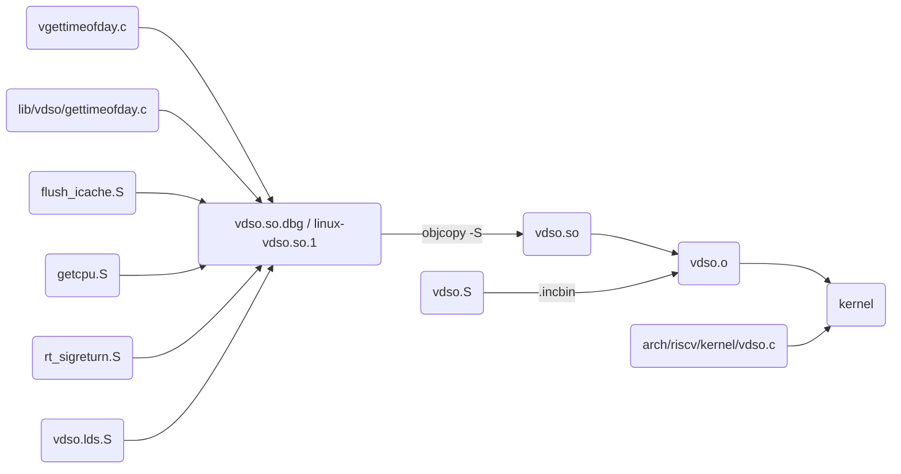

## 概述

本文阐述了什么是 vDSO 技术，以及该技术解决的问题是什么，最后详细分析了在 RISC-V 架构下的实现细节。

说明：文中涉及的 Linux 源码是基于 5.17 版本

## vDSO 是什么

### 背景

在 Linux 众多的系统调用中，有一部分存在以下特点：
* 系统调用本身很快，主要时间花费在 `trap` 过程
* 无需高特权级别权限

这部分系统调用如果能够直接在用户空间中执行，则能够对性能有较大的改善。`gettimeofday` 就是一个典型的例子，它仅仅只是读取内核中的时间信息，而且对于许多应用程序来说，读取系统时间是必要的同时也是频率很高的行为。

为了改善这部分系统调用的性能，先后出现了 `vsyscall`, `vDSO` 机制来加速系统调用。

### vsyscall

`vsyscall` 或 `virtual system call` 是第一种也是最古老的一种用于加快系统调用的机制，最早在 [Linux 2.5.53][2] 被引入内核。`vsyscall` 的工作原则其实十分简单。Linux 内核在用户空间映射一个包含一些变量及一些系统调用的实现的内存页。因此这些系统调用将在用户空间下执行，而不需要触发 trap 机制进行内核。

但是 `vsyscall` 存在以下问题：
1. vsyscall 映射到内存的固定位置 `ffffffffff600000` 处，有潜在的安全风险
2. vsyscall 内存页不包含符号表等信息，在程序出错时进行 `core dump` 会比较麻烦

为了解决上述问题，从而设计了 vDSO 机制，也就是本文讨论的主题。

## vDSO

vDSO (virtual dynamic shared object) 也是一种系统调用加速机制。vDSO 和 vsyscall 的基本原理类似，都是通过提供在用户空间的代码和数据来模拟系统调用。它们的主要区别在于：
* vDSO 是一个 ELF 格式的动态库，拥有完整的符号表信息
* 依赖 [ASLR][3] 技术，对 vDSO 的地址进行随机化

### linux-vdso.so.1

通过 `ldd` 命令可以查看程序依赖的共享库信息。
```sh
$ ldd /bin/ls
        linux-vdso.so.1 (0x00007fff8faed000)
        libselinux.so.1 => /lib/riscv64-linux-gnu/libselinux.so.1 (0x00007fff8faaa000)
        libc.so.6 => /lib/riscv64-linux-gnu/libc.so.6 (0x00007fff8f977000)
        /lib/ld-linux-riscv64-lp64d.so.1 (0x00007fff8faef000)
        libpcre2-8.so.0 => /lib/riscv64-linux-gnu/libpcre2-8.so.0 (0x00007fff8f925000)

```
其中 `linux-vdso.so.1` 就是 vDSO 对于的共享库名称，因为其被编译进内核代码中所以没有具体的文件路径。

### functions

因为依赖 vDSO 实现的系统调用由于需要满足本文背景中提到的两个特点，因此数量并不多，详细情况可以通过 `objdump` 工具查看 vDSO 定义的系统调用列表。内核编译过程中生成 `arch/riscv/kernel/vdso/vdso.so`，之后再链接进内核，因此可以通过 vdso.so 查看支持的系统调用有哪些：

```sh
$ objdump -T /labs/linux-lab/build/riscv64/virt/linux/v5.17/arch/riscv/kernel/vdso/vdso.so

/labs/linux-lab/build/riscv64/virt/linux/v5.17/arch/riscv/kernel/vdso/vdso.so:     file format elf64-little

DYNAMIC SYMBOL TABLE:
00000000000004e8 l    d  .eh_frame      0000000000000000              .eh_frame
0000000000000a64 g    DF .text  000000000000018a  LINUX_4.15  __vdso_gettimeofday
0000000000000bee g    DF .text  000000000000007a  LINUX_4.15  __vdso_clock_getres
0000000000000000 g    DO *ABS*  0000000000000000  LINUX_4.15  LINUX_4.15
0000000000000800 g    DF .text  0000000000000008  LINUX_4.15  __vdso_rt_sigreturn
000000000000080a g    DF .text  000000000000025a  LINUX_4.15  __vdso_clock_gettime
0000000000000c74 g    DF .text  000000000000000a  LINUX_4.15  __vdso_flush_icache
0000000000000c68 g    DF .text  000000000000000a  LINUX_4.15  __vdso_getcpu

```
可以看出 vDSO 中共有 6 个函数，分别对应 6 个系统调用，函数命名规则由统一前缀 `__vdso_` 拼接上系统调用名组成。比如 `__vdso_gettimeofday` 函数对应 `gettimeofday` 系统调用。

在 RISC-V 架构下，目前真正能够起到加速系统调用目的的其实只有时间相关的三个，其他函数的实现只是触发真实的系统调用而已。

### 各处理器架构上对比

在不同处理器架构下，vDSO 的实现存在一些差异，大致包括：
* vDSO 名称：如 i386 上命名为 `linux-gate.so.1`，`ppc/64` 上又命名为 `linux-vdso64.so.1`。
* 函数名命前缀：如 x86 上前缀是 `__vdso_`，而 `mips` 上前缀是 `__kernel_`
* 支持的系统调用数量：如 arm 上支持两个，x86 上支持四个。
* 真正能实现加速的系统调用数量：一些架构上 vDSO 中虽然实现了系统调用，但背后还是通过真正的系统调用实现，没有起到加速的效果。

下面列出了部分架构下 vDSO 支持的系统调用，以及对比原生系统调用是否实现了加速的信息：

处理器架构 \ 系统调用 | rt_sigreturn | flush_icache | getcpu | clock_gettime | gettimeofday | clock_getres
--- | --- | --- | --- | --- | --- | ---
riscv   | n | n | n | s | s | s
arm64   | n |   |   | s | s | s
x86     |   |   | s | s | s | s

表格内容取值说明：
* s：表示支持该系统调用并实现了加速
* n：表示通过真正的系统调用进行支持
* 空白：表示未支持

其他更多详情具体可以参考 [vdso(7) — Linux manual page][4]。


### 与原生系统调用性能对比

vDSO 是为了加速系统调用而设计的机制，那到底效果如何呢？

 
> 图片来自 [LPC_vDSO.pdf][1]

上面这张图中比较了 arm 下 vDSO 和原生系统调用的性能，从图中可以看出，经过 vDSO 加速后系统调用性能提升约 7 倍左右，加速效果还是挺明显的。

### 使用

## vDSO 实现

## vDSO

### 什么是 vDSO

vDSO（virtual Dynamic Shared Object）是 Linux 内核提供的一个共享库，内核会将它映射到所有的用户进程内，以此来实现"用户空间的系统调用"（virtual syscalls）。

### Virtual syscalls (vsyscall)

在操作系统的众多 syscall 中，有一部分包含以下特点：
* syscall 本身执行很快，大部分时间花费在内核模式的切换上
* 不需要内核模式的权限

这类比较典型的有时间相关的 syscall。针对这部分 syscall，可以在用户空间提供一些代码（virtual syscalls）来模拟 syscall 接口，以达到更好的效率。

### 为什么要用 DSO

使用共享库来实现 virtual syscalls 有以下优势：
* 更灵活：no fixed offset within the vDSO
* 易于调试：appears like a regular library to userspace → improved debugging
* harder to exploit： takes advantage of ASLR

### vDSO name

       user ABI   vDSO name
       ─────────────────────────────
       aarch64    linux-vdso.so.1
       arm        linux-vdso.so.1
       ia64       linux-gate.so.1
       mips       linux-vdso.so.1
       ppc/32     linux-vdso32.so.1
       ppc/64     linux-vdso64.so.1
       riscv      linux-vdso.so.1
       s390       linux-vdso32.so.1
       s390x      linux-vdso64.so.1
       sh         linux-gate.so.1
       i386       linux-gate.so.1
       x86-64     linux-vdso.so.1
       x86/x32    linux-vdso.so.1

### vDSO 列表

```sh
$ objdump -T ./arch/riscv/kernel/vdso/vdso.so

./arch/riscv/kernel/vdso/vdso.so:     file format elf64-little

DYNAMIC SYMBOL TABLE:
00000000000004e8 l    d  .eh_frame      0000000000000000              .eh_frame
0000000000000a64 g    DF .text  000000000000018a  LINUX_4.15  __vdso_gettimeofday
0000000000000bee g    DF .text  000000000000007a  LINUX_4.15  __vdso_clock_getres
0000000000000000 g    DO *ABS*  0000000000000000  LINUX_4.15  LINUX_4.15
0000000000000800 g    DF .text  0000000000000008  LINUX_4.15  __vdso_rt_sigreturn
000000000000080a g    DF .text  000000000000025a  LINUX_4.15  __vdso_clock_gettime
0000000000000c74 g    DF .text  000000000000000a  LINUX_4.15  __vdso_flush_icache
0000000000000c68 g    DF .text  000000000000000a  LINUX_4.15  __vdso_getcpu

```

### 如何使用

用户程序使用 vDSO 有两种方法：
* C 标准库对 vDSO 函数的封装
* 找到 vDSO 函数地址进行调用


C 标准库对 vDSO 进行了封装，在使用相关 Syscall 时会自动跳转到 vDSO 进行执行。

```c
#include<sys/time.h>
#include <unistd.h>
#include <stdio.h>

int main() 
{
  struct timeval tv;
  struct timezone tz;
 
  gettimeofday(&tv, &tz);
  printf("tv_sec=%d, tv_usec=%d\n", tv.tv_sec, tv.tv_usec);
  
  return 0;
}
```

怎么判断 C 标准库是否使用了 vDSO 呢，可以利用 `strace` 工具，它会将程序使用的 syscall 进行输出，而如果程序使用了 vDSO 则不会有 syscall 的调用记录。

```shell
$ cat vdso.c
#include<sys/time.h>
#include <unistd.h>
#include <stdio.h>

int main() {
    struct timeval tv;
    struct timezone tz;
    gettimeofday(&tv, &tz);
    printf("tv_sec=%d, tv_usec=%d\n", tv.tv_sec, tv.tv_usec);
    return 0;
}
$ gcc vdso.c -o vdso.out
$ cat syscall.c
#include <unistd.h>
#include <sys/syscall.h>
#include <sys/types.h>
#include <signal.h>
#include <sys/time.h>

int main()
{
    struct timeval tv;
    struct timezone tz;

    syscall(SYS_gettimeofday, &tv, &tz);
    printf("tv_sec=%d, tv_usec=%d\n", tv.tv_sec, tv.tv_usec);
    return 0;
}
$ gcc syscall.c -o syscall.out
$ strace ./syscall.out 2>&1 | grep gettiemofday
gettimeofday({tv_sec=1657201564, tv_usec=553206}, {tz_minuteswest=0, tz_dsttime=0}) = 0
$ strace ./vdso.out 2>&1 | grep gettiemofday
$
```

另外一种使用方式，可以通过 `getauxval` 找到 vDSO 共享库在当前进程用户态内存中的地址，然后根据共享库文件格式找到对应函数的地址进行调用。具体可以参考如下示例代码。

```c++
#include<sys/auxv.h>
#include <stdio.h>
#include <string.h>
#include <elf.h>
#include <sys/time.h>

typedef unsigned char u8;

void* vdso_sym(char* symname) {
    auto vdso_addr = (u8*)getauxval(AT_SYSINFO_EHDR);
    
    auto elf_header = (Elf64_Ehdr*)vdso_addr;
    auto section_header = (Elf64_Shdr*)(vdso_addr + elf_header->e_shoff);

    char* dynstr = 0;

    for (int i=0; i<elf_header->e_shnum; i++) {
        auto& s = section_header[i];
        auto& ss_ = section_header[elf_header->e_shstrndx];
        auto name = (char*)(vdso_addr + ss_.sh_offset + s.sh_name);
        if (strcmp(name, ".dynstr") == 0) {
            dynstr = (char*)(vdso_addr + s.sh_offset);
            break;
        }
    }

    void *ret = NULL;

    for (int i=0; i<elf_header->e_shnum; i++) {
        auto name = (char*)(vdso_addr + section_header[elf_header->e_shstrndx].sh_offset + section_header[i].sh_name);
        if (strcmp(name, ".dynsym") == 0) {
            for (int si=0; si<(section_header[i].sh_size/section_header[i].sh_entsize); si++) {
                auto name = dynstr + ((Elf64_Sym*)(vdso_addr + section_header[i].sh_offset))[si].st_name;
                if (strcmp(name, symname) == 0) {
                    ret = (vdso_addr + ((Elf64_Sym*)(vdso_addr + section_header[i].sh_offset))[si].st_value);
                    break;
                }
            }
            if (ret) break;
        }
    }
    return ret;
}

typedef int (gettimeofday_t)(struct timeval * tv, struct timezone * tz);

int main() 
{
    auto my_gettimeofday = (gettimeofday_t*)vdso_sym("__vdso_gettimeofday");

    struct timeval tv;
    struct timezone tz;
    my_gettimeofday(&tv, &tz);
    printf("tv_sec=%d, tv_usec=%d\n", tv.tv_sec, tv.tv_usec);

    return 0;
}
```

### vDSO 与 Syscall 性能比较

arm 架构下的 vDSO 与原生 syscall 的性能对比图 [1]。


## 技术实现

### build

```
arch/riscv/kernel/vdso.c
arch/riscv/kernel/vdso/vgettimeofday.c //__vdso_clock_gettime、__vdso_gettimeofday、__vdso_clock_getres
arch/riscv/kernel/vdso/flush_icache.S // __vdso_flush_icache
arch/riscv/kernel/vdso/getcpu.S // __vdso_getcpu
arch/riscv/kernel/vdso/rt_sigreturn.S // __vdso_rt_sigreturn
arch/riscv/kernel/vdso/vdso.lds.S // 链接脚本
arch/riscv/kernel/vdso/vdso.S
lib/vdso/gettimeofday.c
```



### kernel and userspace setup

vDSO 初始化 [1]。


fs/exec.c 
    do_execve
        do_execveat_common
            bprm_execve
                exec_binprm
                    search_binary_handler
                        load_elf_binary / fmt->load_binary(bprm)
                            ARCH_SETUP_ADDITIONAL_PAGES
                                arch/riscv/kernel/vdso.c arch_setup_additional_pages
                                    __setup_additional_pages
                                        [vdso] [vvar] 映射到用户内存
                                        _install_special_mapping
                                            VM_READ
                                            VM_EXEC
                                        
                            create_elf_tables
                                ARCH_DLINFO
                                    AT_SYSINFO_EHDR
                                copy_to_user(sp, mm->saved_auxv)
                            START_THREAD / start_thread


arch/riscv/kernel/vdso.c
    arch_initcall(vdso_init);
    vdso_init   初始化 vdso_info 对象
        vvar_fault
        vdso_mremap
        __vdso_init 
            pfn
include/vdso/datapage.h
arch/riscv/include/asm/vdso/vsyscall.h
arch/riscv/include/asm/vdso/gettimeofday.h

csu/libc-start.c
LIB_START_MAIN

hexdump -x /proc/self/auxv
cat /proc/self/maps

process stack:
auxvec
env
arg
stack

glibc: 
dynamic linker
sysdeps/unix/sysv/linux/dl-sysdep.c
    `_dl_sysdep_start`
    `_dl_sysdep_parse_arguments`
sysdeps/unix/sysv/linux/dl-parse_auxv.h
    `_dl_parse_auxv`

libc init
sysdeps/unix/sysv/linux/dl-vdso-setup.h
    setup_vdso_pointers
elf/setup-vdso.h
    setup_vdso
elf/rtld.c
    dl_main

libc call
sysdeps/unix/sysv/linux/gettimeofday.c
    INLINE_VSYSCALL
sysdeps/unix/sysv/linux/sysdep-vdso.h
    INTERNAL_VSYSCALL_CALL / dl_vdso_gettimeofday

### kernel update vvar

kernel/time/timekeeping.c
timekeeping_update
kernel/time/vsyscall.c
update_vsyscall


kernel/time/time.c
SYSCALL settimeofday
do_sys_settimeofday64
kernel/time/vsyscall.c
update_vsyscall_tz

### shared object

相关代码以及如何生成。

### memory layout

cat /proc/self/maps

### so 加载

### gettimeofday 执行过程

### 最近的代码提交

### 可能的 patch

完善 RISC-V 上的 vDSO 支持的函数，现在只有 gettimeofday

[1]: https://blog.linuxplumbersconf.org/2016/ocw/system/presentations/3711/original/LPC_vDSO.pdf
[2]: https://mirrors.edge.kernel.org/pub/linux/kernel/v2.5/ChangeLog-2.5.53
[3]: https://en.wikipedia.org/wiki/Address_space_layout_randomization
[4]: https://man7.org/linux/man-pages/man7/vdso.7.html

参考资料
- [什麼是 Linux vDSO 與 vsyscall？——發展過程](https://alittleresearcher.blogspot.com/2017/04/linux-vdso-and-vsyscall-history.html)