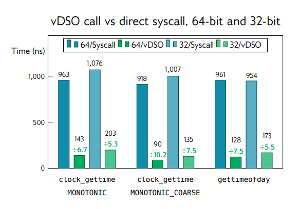
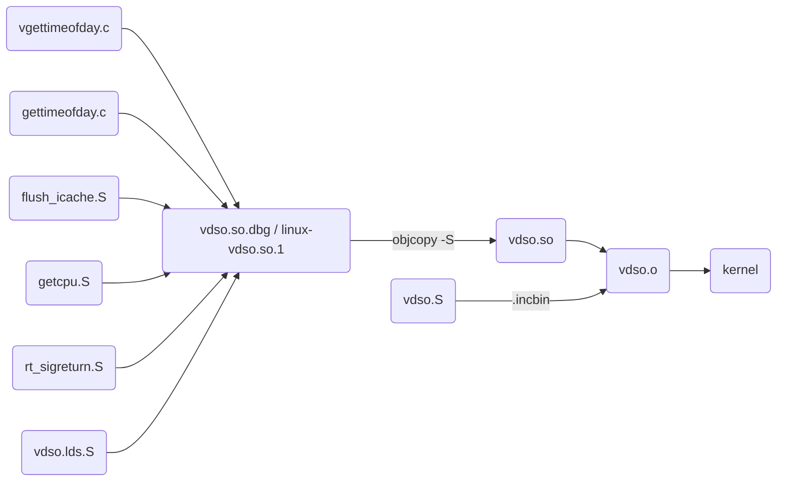
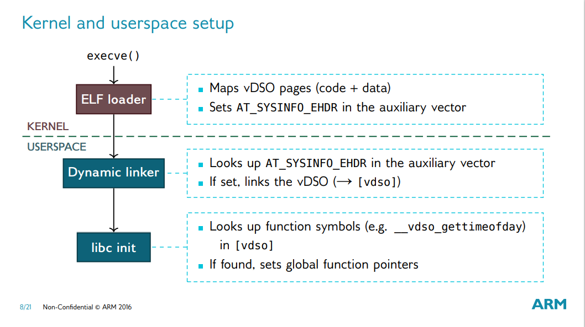

## vDSO

### 什么是 vDSO

vDSO（virtual Dynamic Shared Object）是 Linux 内核提供的一个共享库，内核会将它映射到所有的用户进程内，以此来实现"用户空间的系统调用"（virtual syscalls）。

### Virtual syscalls (vsyscall)

在操作系统的众多 syscall 中，有一部分包含以下特点：
* syscall 本身执行很快，大部分时间花费在内核模式的切换上
* 不需要内核模式的权限

这类比较典型的有时间相关的 syscall。针对这部分 syscall，可以在用户空间提供一些代码（virtual syscalls）来模拟 syscall 接口，以达到更好的效率。

### 为什么要用 DSO

使用共享库来实现 virtual syscalls 有以下优势：
* 更灵活：no fixed offset within the vDSO
* 易于调试：appears like a regular library to userspace → improved debugging
* harder to exploit： takes advantage of ASLR

### vDSO name

       user ABI   vDSO name
       ─────────────────────────────
       aarch64    linux-vdso.so.1
       arm        linux-vdso.so.1
       ia64       linux-gate.so.1
       mips       linux-vdso.so.1
       ppc/32     linux-vdso32.so.1
       ppc/64     linux-vdso64.so.1
       riscv      linux-vdso.so.1
       s390       linux-vdso32.so.1
       s390x      linux-vdso64.so.1
       sh         linux-gate.so.1
       i386       linux-gate.so.1
       x86-64     linux-vdso.so.1
       x86/x32    linux-vdso.so.1

### vDSO 列表

```sh
$ objdump -T ./arch/riscv/kernel/vdso/vdso.so

./arch/riscv/kernel/vdso/vdso.so:     file format elf64-little

DYNAMIC SYMBOL TABLE:
00000000000004e8 l    d  .eh_frame      0000000000000000              .eh_frame
0000000000000a64 g    DF .text  000000000000018a  LINUX_4.15  __vdso_gettimeofday
0000000000000bee g    DF .text  000000000000007a  LINUX_4.15  __vdso_clock_getres
0000000000000000 g    DO *ABS*  0000000000000000  LINUX_4.15  LINUX_4.15
0000000000000800 g    DF .text  0000000000000008  LINUX_4.15  __vdso_rt_sigreturn
000000000000080a g    DF .text  000000000000025a  LINUX_4.15  __vdso_clock_gettime
0000000000000c74 g    DF .text  000000000000000a  LINUX_4.15  __vdso_flush_icache
0000000000000c68 g    DF .text  000000000000000a  LINUX_4.15  __vdso_getcpu

```

### 如何使用

用户程序使用 vDSO 有两种方法：
* C 标准库对 vDSO 函数的封装
* 找到 vDSO 函数地址进行调用


C 标准库对 vDSO 进行了封装，在使用相关 Syscall 时会自动跳转到 vDSO 进行执行。

```c
#include<sys/time.h>
#include <unistd.h>
#include <stdio.h>

int main() 
{
  struct timeval tv;
  struct timezone tz;
 
  gettimeofday(&tv, &tz);
  printf("tv_sec=%d, tv_usec=%d\n", tv.tv_sec, tv.tv_usec);
  
  return 0;
}
```

怎么判断 C 标准库是否使用了 vDSO 呢，可以利用 `strace` 工具，它会将程序使用的 syscall 进行输出，而如果程序使用了 vDSO 则不会有 syscall 的调用记录。

```shell
$ cat vdso.c
#include<sys/time.h>
#include <unistd.h>
#include <stdio.h>

int main() {
    struct timeval tv;
    struct timezone tz;
    gettimeofday(&tv, &tz);
    printf("tv_sec=%d, tv_usec=%d\n", tv.tv_sec, tv.tv_usec);
    return 0;
}
$ gcc vdso.c -o vdso.out
$ cat syscall.c
#include <unistd.h>
#include <sys/syscall.h>
#include <sys/types.h>
#include <signal.h>
#include <sys/time.h>

int main()
{
    struct timeval tv;
    struct timezone tz;

    syscall(SYS_gettimeofday, &tv, &tz);
    printf("tv_sec=%d, tv_usec=%d\n", tv.tv_sec, tv.tv_usec);
    return 0;
}
$ gcc syscall.c -o syscall.out
$ strace ./syscall.out 2>&1 | grep gettiemofday
gettimeofday({tv_sec=1657201564, tv_usec=553206}, {tz_minuteswest=0, tz_dsttime=0}) = 0
$ strace ./vdso.out 2>&1 | grep gettiemofday
$
```

另外一种使用方式，可以通过 `getauxval` 找到 vDSO 共享库在当前进程用户态内存中的地址，然后根据共享库文件格式找到对应函数的地址进行调用。具体可以参考如下示例代码。

```c++
#include<sys/auxv.h>
#include <stdio.h>
#include <string.h>
#include <elf.h>
#include <sys/time.h>

typedef unsigned char u8;

void* vdso_sym(char* symname) {
    auto vdso_addr = (u8*)getauxval(AT_SYSINFO_EHDR);
    
    auto elf_header = (Elf64_Ehdr*)vdso_addr;
    auto section_header = (Elf64_Shdr*)(vdso_addr + elf_header->e_shoff);

    char* dynstr = 0;

    for (int i=0; i<elf_header->e_shnum; i++) {
        auto& s = section_header[i];
        auto& ss_ = section_header[elf_header->e_shstrndx];
        auto name = (char*)(vdso_addr + ss_.sh_offset + s.sh_name);
        if (strcmp(name, ".dynstr") == 0) {
            dynstr = (char*)(vdso_addr + s.sh_offset);
            break;
        }
    }

    void *ret = NULL;

    for (int i=0; i<elf_header->e_shnum; i++) {
        auto name = (char*)(vdso_addr + section_header[elf_header->e_shstrndx].sh_offset + section_header[i].sh_name);
        if (strcmp(name, ".dynsym") == 0) {
            for (int si=0; si<(section_header[i].sh_size/section_header[i].sh_entsize); si++) {
                auto name = dynstr + ((Elf64_Sym*)(vdso_addr + section_header[i].sh_offset))[si].st_name;
                if (strcmp(name, symname) == 0) {
                    ret = (vdso_addr + ((Elf64_Sym*)(vdso_addr + section_header[i].sh_offset))[si].st_value);
                    break;
                }
            }
            if (ret) break;
        }
    }
    return ret;
}

typedef int (gettimeofday_t)(struct timeval * tv, struct timezone * tz);

int main() 
{
    auto my_gettimeofday = (gettimeofday_t*)vdso_sym("__vdso_gettimeofday");

    struct timeval tv;
    struct timezone tz;
    my_gettimeofday(&tv, &tz);
    printf("tv_sec=%d, tv_usec=%d\n", tv.tv_sec, tv.tv_usec);

    return 0;
}
```

### vDSO 与 Syscall 性能比较

arm 架构下的 vDSO 与原生 syscall 的性能对比图 [1]。




## 技术实现

### build

```
arch/riscv/kernel/vdso.c
arch/riscv/kernel/vdso/vgettimeofday.c //__vdso_clock_gettime、__vdso_gettimeofday、__vdso_clock_getres
arch/riscv/kernel/vdso/flush_icache.S // __vdso_flush_icache
arch/riscv/kernel/vdso/getcpu.S // __vdso_getcpu
arch/riscv/kernel/vdso/rt_sigreturn.S // __vdso_rt_sigreturn
arch/riscv/kernel/vdso/vdso.lds.S // 链接脚本
arch/riscv/kernel/vdso/vdso.S
lib/vdso/gettimeofday.c
```



### kernel and userspace setup

vDSO 初始化 [1]。



### shared object

相关代码以及如何生成。

### memory layout

cat /proc/self/maps

### so 加载

### gettimeofday 执行过程

### 最近的代码提交

[1]: https://blog.linuxplumbersconf.org/2016/ocw/system/presentations/3711/original/LPC_vDSO.pdf
