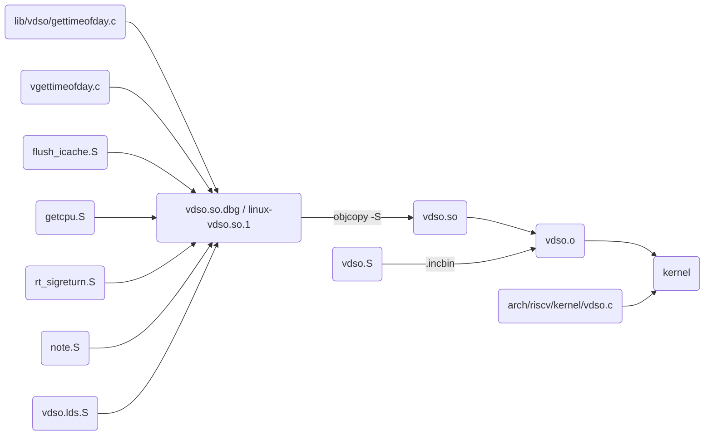
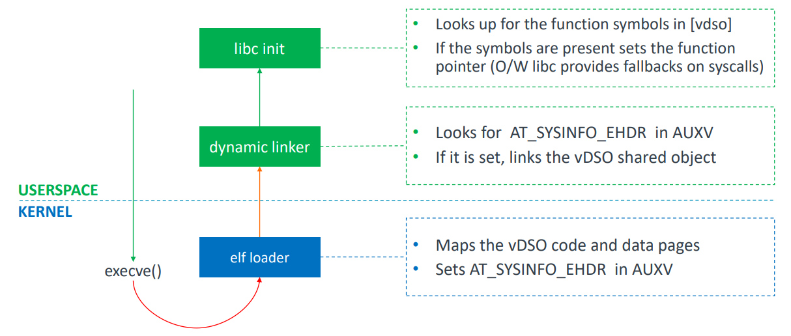

## 概述

在上一篇文章[什么是 vDSO](../RISC-V_vdso_1/index.md)中介绍了 vDSO 的相关背景和概念，本篇文章会进一步通过对 Linux 内核及 glibc 相关代码的研究，来分析 vDSO 的实现原理。

说明：文中涉及的 Linux 源码是基于 5.17 版本，glibc 是基于 2.35 版本。


## Build

Linux 内核中 vDSO 代码包括以下几部分：
* lib/vdso/：架构无关部分
  * gettimeofday.c
* arch/riscv/kernel/：架构相关部分
  * vdso.c：数据结构定义及初始化
  * vdso/：导出函数入口
    * flush_icache.S
    * getcpu.S
    * rt_sigreturn.S
    * vgettimeofday.c
    * vdso.S
    * vdso.lds.S

> 下面未加路径的文件默认路径为 arch/riscv/kernel/vdso



上图描述了上述代码如何编译成 `linux-vdso.so.1` 及如何集成到内核中的大体流程。整个流程大致可以分为两个阶段：
1. 生成共享库 `linux-vdso.so.1`
2. 共享库集成到内核

下面会结合内核编译日志和内核源码一起分析整个构建过程。

### 生成共享库 `linux-vdso.so.1`

```sh
  riscv64-linux-gnu-gcc -E -Wp,-MMD,arch/riscv/kernel/vdso/.vdso.lds.d  -nostdinc -I./arch/riscv/include -I./arch/riscv/include/generated  -I./include -I./arch/riscv/include/uapi -I./arch/riscv/include/generated/uapi -I./include/uapi -I./include/generated/uapi -include ./include/linux/compiler-version.h -include ./include/linux/kconfig.h -D__KERNEL__ -fmacro-prefix-map=./=    -P -C -Uriscv -P -Uriscv -D__ASSEMBLY__ -DLINKER_SCRIPT -o arch/riscv/kernel/vdso/vdso.lds arch/riscv/kernel/vdso/vdso.lds.S
  riscv64-linux-gnu-gcc -Wp,-MMD,arch/riscv/kernel/vdso/.rt_sigreturn.o.d  -nostdinc -I./arch/riscv/include -I./arch/riscv/include/generated  -I./include -I./arch/riscv/include/uapi -I./arch/riscv/include/generated/uapi -I./include/uapi -I./include/generated/uapi -include ./include/linux/compiler-version.h -include ./include/linux/kconfig.h -D__KERNEL__ -fmacro-prefix-map=./= -D__ASSEMBLY__ -fno-PIE -mabi=lp64 -march=rv64imafdc -Wa,-gdwarf-2    -c -o arch/riscv/kernel/vdso/rt_sigreturn.o arch/riscv/kernel/vdso/rt_sigreturn.S 
  riscv64-linux-gnu-gcc -Wp,-MMD,arch/riscv/kernel/vdso/.vgettimeofday.o.d  -nostdinc -I./arch/riscv/include -I./arch/riscv/include/generated  -I./include -I./arch/riscv/include/uapi -I./arch/riscv/include/generated/uapi -I./include/uapi -I./include/generated/uapi -include ./include/linux/compiler-version.h -include ./include/linux/kconfig.h -include ./include/linux/compiler_types.h -D__KERNEL__ -fmacro-prefix-map=./= -Wall -Wundef -Werror=strict-prototypes -Wno-trigraphs -fno-strict-aliasing -fno-common -fshort-wchar -fno-PIE -Werror=implicit-function-declaration -Werror=implicit-int -Werror=return-type -Wno-format-security -std=gnu89 -mabi=lp64 -march=rv64imac -mno-save-restore -DCONFIG_PAGE_OFFSET=0xffffaf8000000000 -mcmodel=medany -fno-omit-frame-pointer -mstrict-align -fno-delete-null-pointer-checks -Wno-frame-address -Wno-format-truncation -Wno-format-overflow -Wno-address-of-packed-member -O2 --param=allow-store-data-races=0 -Wframe-larger-than=2048 -fstack-protector-strong -Wimplicit-fallthrough=5 -Wno-main -Wno-unused-but-set-variable -Wno-unused-const-variable -fno-omit-frame-pointer -fno-optimize-sibling-calls -fno-stack-clash-protection -Wdeclaration-after-statement -Wvla -Wno-pointer-sign -Wcast-function-type -Wno-stringop-truncation -Wno-array-bounds -Wno-stringop-overflow -Wno-restrict -Wno-maybe-uninitialized -Wno-alloc-size-larger-than -fno-strict-overflow -fno-stack-check -fconserve-stack -Werror=date-time -Werror=incompatible-pointer-types -Werror=designated-init -Wno-packed-not-aligned -g -fno-stack-protector -fPIC -include /labs/linux-lab/src/linux-stable/lib/vdso/gettimeofday.c    -DKBUILD_MODFILE='"arch/riscv/kernel/vdso/vgettimeofday"' -DKBUILD_BASENAME='"vgettimeofday"' -DKBUILD_MODNAME='"vgettimeofday"' -D__KBUILD_MODNAME=kmod_vgettimeofday -c -o arch/riscv/kernel/vdso/vgettimeofday.o arch/riscv/kernel/vdso/vgettimeofday.c 
  riscv64-linux-gnu-gcc -Wp,-MMD,arch/riscv/kernel/vdso/.getcpu.o.d  -nostdinc -I./arch/riscv/include -I./arch/riscv/include/generated  -I./include -I./arch/riscv/include/uapi -I./arch/riscv/include/generated/uapi -I./include/uapi -I./include/generated/uapi -include ./include/linux/compiler-version.h -include ./include/linux/kconfig.h -D__KERNEL__ -fmacro-prefix-map=./= -D__ASSEMBLY__ -fno-PIE -mabi=lp64 -march=rv64imafdc -Wa,-gdwarf-2    -c -o arch/riscv/kernel/vdso/getcpu.o arch/riscv/kernel/vdso/getcpu.S 
  riscv64-linux-gnu-gcc -Wp,-MMD,arch/riscv/kernel/vdso/.flush_icache.o.d  -nostdinc -I./arch/riscv/include -I./arch/riscv/include/generated  -I./include -I./arch/riscv/include/uapi -I./arch/riscv/include/generated/uapi -I./include/uapi -I./include/generated/uapi -include ./include/linux/compiler-version.h -include ./include/linux/kconfig.h -D__KERNEL__ -fmacro-prefix-map=./= -D__ASSEMBLY__ -fno-PIE -mabi=lp64 -march=rv64imafdc -Wa,-gdwarf-2    -c -o arch/riscv/kernel/vdso/flush_icache.o arch/riscv/kernel/vdso/flush_icache.S 
  riscv64-linux-gnu-gcc -Wp,-MMD,arch/riscv/kernel/vdso/.note.o.d  -nostdinc -I./arch/riscv/include -I./arch/riscv/include/generated  -I./include -I./arch/riscv/include/uapi -I./arch/riscv/include/generated/uapi -I./include/uapi -I./include/generated/uapi -include ./include/linux/compiler-version.h -include ./include/linux/kconfig.h -D__KERNEL__ -fmacro-prefix-map=./= -D__ASSEMBLY__ -fno-PIE -mabi=lp64 -march=rv64imafdc -Wa,-gdwarf-2    -c -o arch/riscv/kernel/vdso/note.o arch/riscv/kernel/vdso/note.S 

```

从上述编译日志可以看出，首先 `vdso.lds.S` 是链接脚本文件，会通过 `gcc -E` 命令执行预处理。然后 `lib/vdso/gettimeofday.c`，`vgettimeofday.c`，`flush_icache.S`，`getcpu.S`，`rt_sigreturn.S`，`note.S` 这几个文件会通过 `gcc -c` 命令编译成 `.o` 文件。

```
riscv64-linux-gnu-ld  -melf64lriscv   -shared -S -soname=linux-vdso.so.1 --build-id=sha1 --hash-style=both --eh-frame-hdr -T arch/riscv/kernel/vdso/vdso.lds arch/riscv/kernel/vdso/rt_sigreturn.o arch/riscv/kernel/vdso/vgettimeofday.o arch/riscv/kernel/vdso/getcpu.o arch/riscv/kernel/vdso/flush_icache.o arch/riscv/kernel/vdso/note.o -o arch/riscv/kernel/vdso/vdso.so.dbg.tmp && riscv64-linux-gnu-objcopy  -G __vdso_rt_sigreturn  -G __vdso_vgettimeofday  -G __vdso_getcpu  -G __vdso_flush_icache arch/riscv/kernel/vdso/vdso.so.dbg.tmp arch/riscv/kernel/vdso/vdso.so.dbg && rm arch/riscv/kernel/vdso/vdso.so.dbg.tmp
```

接下来是生成 `vdso.so.dbg`。就是把上一步生成的中间文件通过 `ld` 命令链接起来生成共享库文件。这里通过 `-soname=linux-vdso.so.1` 参数指定了库的真实名字。另外其中的 `objcopy -G` 命令是将本地函数变为全局函数，我理解现在的版本中已经不需要了，因为在后面的流程中，会移除静态符号表信息。

`vdso.so.dbg` 的真实名字就是 `linux-vdso.so.1`，也可以通过下面的命令进行验证：
```sh
$ readelf -d  /labs/linux-lab/build/riscv64/virt/linux/v5.17/arch/riscv/kernel/vdso/vdso.so.dbg

Dynamic section at offset 0x390 contains 14 entries:
  Tag        Type                         Name/Value
 0x000000000000000e (SONAME)             Library soname: [linux-vdso.so.1]
 0x0000000000000004 (HASH)               0x120
 0x000000006ffffef5 (GNU_HASH)           0x158
 0x0000000000000005 (STRTAB)             0x270
 0x0000000000000006 (SYMTAB)             0x198
 0x000000000000000a (STRSZ)              143 (bytes)
 0x000000000000000b (SYMENT)             24 (bytes)
 0x0000000000000007 (RELA)               0x0
 0x0000000000000008 (RELASZ)             0 (bytes)
 0x0000000000000009 (RELAENT)            24 (bytes)
 0x000000006ffffffc (VERDEF)             0x318
 0x000000006ffffffd (VERDEFNUM)          2
 0x000000006ffffff0 (VERSYM)             0x300
 0x0000000000000000 (NULL)               0x0
```

### 共享库集成到内核

```sh
riscv64-linux-gnu-objcopy -S  arch/riscv/kernel/vdso/vdso.so.dbg arch/riscv/kernel/vdso/vdso.so
```

先通过 `objcopy -S` 命令将 `vdso.so.dbg` 移除符号信息进而生成 `vdso.so`。这主要是为了减少集成到内核的代码大小。

```sh
  riscv64-linux-gnu-gcc -Wp,-MMD,arch/riscv/kernel/.vdso.o.d  -nostdinc -I./arch/riscv/include -I./arch/riscv/include/generated  -I./include -I./arch/riscv/include/uapi -I./arch/riscv/include/generated/uapi -I./include/uapi -I./include/generated/uapi -include ./include/linux/compiler-version.h -include ./include/linux/kconfig.h -include ./include/linux/compiler_types.h -D__KERNEL__ -fmacro-prefix-map=./= -Wall -Wundef -Werror=strict-prototypes -Wno-trigraphs -fno-strict-aliasing -fno-common -fshort-wchar -fno-PIE -Werror=implicit-function-declaration -Werror=implicit-int -Werror=return-type -Wno-format-security -std=gnu89 -mabi=lp64 -march=rv64imac -mno-save-restore -DCONFIG_PAGE_OFFSET=0xffffaf8000000000 -mcmodel=medany -fno-omit-frame-pointer -mstrict-align -fno-delete-null-pointer-checks -Wno-frame-address -Wno-format-truncation -Wno-format-overflow -Wno-address-of-packed-member -O2 --param=allow-store-data-races=0 -Wframe-larger-than=2048 -fstack-protector-strong -Wimplicit-fallthrough=5 -Wno-main -Wno-unused-but-set-variable -Wno-unused-const-variable -fno-omit-frame-pointer -fno-optimize-sibling-calls -fno-stack-clash-protection -Wdeclaration-after-statement -Wvla -Wno-pointer-sign -Wcast-function-type -Wno-stringop-truncation -Wno-array-bounds -Wno-stringop-overflow -Wno-restrict -Wno-maybe-uninitialized -Wno-alloc-size-larger-than -fno-strict-overflow -fno-stack-check -fconserve-stack -Werror=date-time -Werror=incompatible-pointer-types -Werror=designated-init -Wno-packed-not-aligned -g    -DKBUILD_MODFILE='"arch/riscv/kernel/vdso"' -DKBUILD_BASENAME='"vdso"' -DKBUILD_MODNAME='"vdso"' -D__KBUILD_MODNAME=kmod_vdso -c -o arch/riscv/kernel/vdso.o arch/riscv/kernel/vdso.c 

```

然后通过 `gcc` 命令将 `arch/riscv/kernel/vdso.c` 编译成 `arch/riscv/kernel/vdso.o` 文件。

```
  riscv64-linux-gnu-gcc -Wp,-MMD,arch/riscv/kernel/vdso/.vdso.o.d  -nostdinc -I./arch/riscv/include -I./arch/riscv/include/generated  -I./include -I./arch/riscv/include/uapi -I./arch/riscv/include/generated/uapi -I./include/uapi -I./include/generated/uapi -include ./include/linux/compiler-version.h -include ./include/linux/kconfig.h -D__KERNEL__ -fmacro-prefix-map=./= -D__ASSEMBLY__ -fno-PIE -mabi=lp64 -march=rv64imafdc -Wa,-gdwarf-2    -c -o arch/riscv/kernel/vdso/vdso.o arch/riscv/kernel/vdso/vdso.S 

```
然后又通过 `gcc` 命令将 `vdso.S` 编译生成了 `vdso.o` 文件。`vdso.S` 文件内部其实就是通过 `.incbin` 将 `vdso.so` 共享库包含进来，同时设置一下内存页对齐。`vdso.S` 的代码如下：
```asm
#include <linux/init.h>
#include <linux/linkage.h>
#include <asm/page.h>

	__PAGE_ALIGNED_DATA

	.globl vdso_start, vdso_end
	.balign PAGE_SIZE
vdso_start:
	.incbin "arch/riscv/kernel/vdso/vdso.so"
	.balign PAGE_SIZE
vdso_end:

	.previous
```
>注意这里的 `vdso.o` 文件和上一步生成的 `arch/riscv/kernel/vdso.o` 不在同一个目录下。

```sh
  riscv64-linux-gnu-ar cDPrST arch/riscv/kernel/vdso/built-in.a arch/riscv/kernel/vdso/vdso.o
  riscv64-linux-gnu-ar cDPrST arch/riscv/kernel/built-in.a arch/riscv/kernel/vdso.o arch/riscv/kernel/vdso/built-in.a ...
```

然后通过 `ar` 命令将 `vdso.o` 打包到 `built-in.a` 文件中，再将 `built-in.a` 和 `arch/riscv/kernel/vdso.o` 一起打包到 `arch/riscv/kernel/built-in.a` 文件中，最终被打包进内核中。

通过下面的命令验证，能看出 `vdso.so` 移除了静态符号表信息。

```sh
$ readelf -sW /labs/linux-lab/build/riscv64/virt/linux/v5.17/arch/riscv/kernel/vdso/vdso.so.dbg

Symbol table '.dynsym' contains 9 entries:
   Num:    Value          Size Type    Bind   Vis      Ndx Name
     0: 0000000000000000     0 NOTYPE  LOCAL  DEFAULT  UND 
     1: 00000000000004e8     0 SECTION LOCAL  DEFAULT   10 
     2: 0000000000000a64   394 FUNC    GLOBAL DEFAULT   11 __vdso_gettimeofday@@LINUX_4.15
     3: 0000000000000bee   122 FUNC    GLOBAL DEFAULT   11 __vdso_clock_getres@@LINUX_4.15
     4: 0000000000000000     0 OBJECT  GLOBAL DEFAULT  ABS LINUX_4.15
     5: 0000000000000800     8 FUNC    GLOBAL DEFAULT   11 __vdso_rt_sigreturn@@LINUX_4.15
     6: 000000000000080a   602 FUNC    GLOBAL DEFAULT   11 __vdso_clock_gettime@@LINUX_4.15
     7: 0000000000000c74    10 FUNC    GLOBAL DEFAULT   11 __vdso_flush_icache@@LINUX_4.15
     8: 0000000000000c68    10 FUNC    GLOBAL DEFAULT   11 __vdso_getcpu@@LINUX_4.15

Symbol table '.symtab' contains 29 entries:
   Num:    Value          Size Type    Bind   Vis      Ndx Name
     0: 0000000000000000     0 NOTYPE  LOCAL  DEFAULT  UND 
     1: 0000000000000120     0 SECTION LOCAL  DEFAULT    1 
     2: 0000000000000158     0 SECTION LOCAL  DEFAULT    2 
     3: 0000000000000198     0 SECTION LOCAL  DEFAULT    3 
     4: 0000000000000270     0 SECTION LOCAL  DEFAULT    4 
     5: 0000000000000300     0 SECTION LOCAL  DEFAULT    5 
     6: 0000000000000318     0 SECTION LOCAL  DEFAULT    6 
     7: 0000000000000350     0 SECTION LOCAL  DEFAULT    7 
     8: 0000000000000390     0 SECTION LOCAL  DEFAULT    8 
     9: 00000000000004c0     0 SECTION LOCAL  DEFAULT    9 
    10: 00000000000004e8     0 SECTION LOCAL  DEFAULT   10 
    11: 0000000000000800     0 SECTION LOCAL  DEFAULT   11 
    12: 0000000000000c80     0 SECTION LOCAL  DEFAULT   12 
    13: 0000000000000000     0 SECTION LOCAL  DEFAULT   13 
    14: 0000000000000000     0 FILE    LOCAL  DEFAULT  ABS vgettimeofday.c
    15: 0000000000000000     0 FILE    LOCAL  DEFAULT  ABS 
    16: fffffffffffff000     0 NOTYPE  LOCAL  DEFAULT  ABS _timens_data
    17: 0000000000000390     0 OBJECT  LOCAL  DEFAULT  ABS _DYNAMIC
    18: 0000000000000c80     0 OBJECT  LOCAL  DEFAULT  ABS _PROCEDURE_LINKAGE_TABLE_
    19: ffffffffffffe000     0 NOTYPE  LOCAL  DEFAULT    1 _vdso_data
    20: 00000000000004c0     0 NOTYPE  LOCAL  DEFAULT    9 __GNU_EH_FRAME_HDR
    21: 0000000000000c80     0 OBJECT  LOCAL  DEFAULT  ABS _GLOBAL_OFFSET_TABLE_
    22: 0000000000000000     0 OBJECT  LOCAL  DEFAULT  ABS LINUX_4.15
    23: 0000000000000a64   394 FUNC    LOCAL  DEFAULT   11 __vdso_gettimeofday
    24: 0000000000000bee   122 FUNC    LOCAL  DEFAULT   11 __vdso_clock_getres
    25: 000000000000080a   602 FUNC    LOCAL  DEFAULT   11 __vdso_clock_gettime
    26: 0000000000000c74    10 FUNC    GLOBAL DEFAULT   11 __vdso_flush_icache
    27: 0000000000000c68    10 FUNC    GLOBAL DEFAULT   11 __vdso_getcpu
    28: 0000000000000800     8 FUNC    GLOBAL DEFAULT   11 __vdso_rt_sigreturn
$ readelf -sW /labs/linux-lab/build/riscv64/virt/linux/v5.17/arch/riscv/kernel/vdso/vdso.so

Symbol table '.dynsym' contains 9 entries:
   Num:    Value          Size Type    Bind   Vis      Ndx Name
     0: 0000000000000000     0 NOTYPE  LOCAL  DEFAULT  UND 
     1: 00000000000004e8     0 SECTION LOCAL  DEFAULT   10 
     2: 0000000000000a64   394 FUNC    GLOBAL DEFAULT   11 __vdso_gettimeofday@@LINUX_4.15
     3: 0000000000000bee   122 FUNC    GLOBAL DEFAULT   11 __vdso_clock_getres@@LINUX_4.15
     4: 0000000000000000     0 OBJECT  GLOBAL DEFAULT  ABS LINUX_4.15
     5: 0000000000000800     8 FUNC    GLOBAL DEFAULT   11 __vdso_rt_sigreturn@@LINUX_4.15
     6: 000000000000080a   602 FUNC    GLOBAL DEFAULT   11 __vdso_clock_gettime@@LINUX_4.15
     7: 0000000000000c74    10 FUNC    GLOBAL DEFAULT   11 __vdso_flush_icache@@LINUX_4.15
     8: 0000000000000c68    10 FUNC    GLOBAL DEFAULT   11 __vdso_getcpu@@LINUX_4.15
```

## vDSO 初始化

vDSO 的初始化按照触发时机可以分为两部分：
* 内核启动时初始化
* 用户进程启动时初始化

### 内核启动时初始化

内核启动时初始化的主要是 `vdso_info` 这个内核对象。顾名思义，`vdso_info` 存储的是 vDSO 的一些信息，它的相关定义如下：
```c
// arch/riscv/kernel/vdso.c
extern char vdso_start[], vdso_end[];

struct __vdso_info {
	const char *name;
	const char *vdso_code_start;  // vdso 代码起始地址
	const char *vdso_code_end;    // vdso 代码结束地址
	unsigned long vdso_pages;     // vdso 代码部分所占内存页数
	/* Data Mapping */
	struct vm_special_mapping *dm;
	/* Code Mapping */
	struct vm_special_mapping *cm;
};

// include/linux/mm_types.h
struct vm_special_mapping {
	const char *name;	/* The name, e.g. "[vdso]". */

	/*
	 * If .fault is not provided, this points to a
	 * NULL-terminated array of pages that back the special mapping.
	 *
	 * This must not be NULL unless .fault is provided.
	 */
	struct page **pages;

	/*
	 * If non-NULL, then this is called to resolve page faults
	 * on the special mapping.  If used, .pages is not checked.
	 */
	vm_fault_t (*fault)(const struct vm_special_mapping *sm,
				struct vm_area_struct *vma,
				struct vm_fault *vmf);

	int (*mremap)(const struct vm_special_mapping *sm,
		     struct vm_area_struct *new_vma);
};
```

`vdso_info` 的初始化代码如下：
```c
// arch/riscv/kernel/vdso.c
static struct __vdso_info vdso_info __ro_after_init = {
	.name = "vdso",
	.vdso_code_start = vdso_start,
	.vdso_code_end = vdso_end,
};

static int __init vdso_init(void)
{
	vdso_info.dm = &rv_vdso_maps[RV_VDSO_MAP_VVAR];
	vdso_info.cm = &rv_vdso_maps[RV_VDSO_MAP_VDSO];

	return __vdso_init();
}

static int __init __vdso_init(void)
{
	unsigned int i;
	struct page **vdso_pagelist;
	unsigned long pfn;

	if (memcmp(vdso_info.vdso_code_start, "\177ELF", 4)) {
		pr_err("vDSO is not a valid ELF object!\n");
		return -EINVAL;
	}

	vdso_info.vdso_pages = (
		vdso_info.vdso_code_end -
		vdso_info.vdso_code_start) >>
		PAGE_SHIFT;

	vdso_pagelist = kcalloc(vdso_info.vdso_pages,
				sizeof(struct page *),
				GFP_KERNEL);
	if (vdso_pagelist == NULL)
		return -ENOMEM;

	/* Grab the vDSO code pages. */
	pfn = sym_to_pfn(vdso_info.vdso_code_start);

	for (i = 0; i < vdso_info.vdso_pages; i++)
		vdso_pagelist[i] = pfn_to_page(pfn + i);

	vdso_info.cm->pages = vdso_pagelist;

	return 0;
}
```

初始化的时候将 `vdso_code_start` 和 `vdso_code_end` 分别赋值了 `vdso_start` 和 `vdso_end`。它们声明成了外部引用，实际上这两个变量的定义是在本文`共享库集成到内核`章节中提到的 `vdso.S` 中，表示了 vDSO 代码段的起始位置和结束位置。

`dm` 和 `cm` 分别表示代码和数据部分的 `vm_special_mapping`（虚拟内存特殊映射对象）。

### 用户进程启动时初始化



在 Linux 系统中，运行一个程序依赖 `fork` 和 `execve` 这两个系统调用。`fork` 会创建一个新进程并复制父进程的数据到新进程中；而 `execve` 则是解析 ELF 文件，将其载入内存，并修改进程的堆栈数据来准备运行环境。而 vDSO 的初始化功能也是在 `execve` 中完成的。

```c
// fs/exec.c
SYSCALL_DEFINE3(execve,
		const char __user *, filename,
		const char __user *const __user *, argv,
		const char __user *const __user *, envp)
{
	return do_execve(getname(filename), argv, envp);
}
```
`SYSCALL_DEFINE3` 是定义系统调用的宏，详情可以参考本系列之前的文章[RISC-V Syscall 系列 2：Syscall 过程分析](../RISC-V_Syscall_2/index.md)。

`execve` 会先经过如下函数调用到达 `load_elf_binary`：
1. `do_execve`
2. `do_execveat_common`：初始化环境和启动参数信息
3. `bprm_execve`：打开文件，使调度器负载均衡等
4. `exec_binprm`
5. `search_binary_handler`：寻找文件格式对应的解析模块
6. `fmt->load_binary()`：调用格式对应的载入函数

而对于 ELF 文件来说，`load_binary` 就是 `load_elf_binary`，下面是 ELF 文件格式载入函数的初始化代码和 `load_elf_binary` 函数代码。

```c
// fs/binfmt_elf.c
static struct linux_binfmt elf_format = {
	.module		= THIS_MODULE,
	.load_binary	= load_elf_binary,
	.load_shlib	= load_elf_library,
	.core_dump	= elf_core_dump,
	.min_coredump	= ELF_EXEC_PAGESIZE,
};

static int load_elf_binary(struct linux_binprm *bprm)
{
  ...
  retval = ARCH_SETUP_ADDITIONAL_PAGES(bprm, elf_ex, !!interpreter);
  ...
  retval = create_elf_tables(bprm, elf_ex,load_addr, interp_load_addr, e_entry);
  ...
}

// include/linux/elf.h
#define ARCH_SETUP_ADDITIONAL_PAGES(bprm, ex, interpreter) arch_setup_additional_pages(bprm, interpreter)
```

`load_elf_binary` 函数内容比较庞大，实现了加载 ELF 文件的核心逻辑。其中跟 vDSO 初始化相关的有如下两个函数：
1. `arch_setup_additional_pages`
2. `create_elf_tables`

#### arch_setup_additional_pages

`arch_setup_additional_pages` 是处理器架构相关的函数，里面主要调用了 `__setup_additional_pages`，它的主要功能是将 vDSO 的代码部分 (text) 和数据部分（vvar）载入用户内存。具体代码如下：
```c
// arch/riscv/kernel/vdso.c
enum vvar_pages {
	VVAR_DATA_PAGE_OFFSET,
	VVAR_TIMENS_PAGE_OFFSET,
	VVAR_NR_PAGES,
};

#define VVAR_SIZE  (VVAR_NR_PAGES << PAGE_SHIFT)

int arch_setup_additional_pages(struct linux_binprm *bprm, int uses_interp)
{
  ...
  ret = __setup_additional_pages(mm, bprm, uses_interp);
  ...
}

static int __setup_additional_pages(struct mm_struct *mm, struct linux_binprm *bprm, int uses_interp)
{
  unsigned long vdso_base, vdso_text_len, vdso_mapping_len;
  void *ret;

  BUILD_BUG_ON(VVAR_NR_PAGES != __VVAR_PAGES);

  vdso_text_len = vdso_info.vdso_pages << PAGE_SHIFT;
  /* Be sure to map the data page */
  vdso_mapping_len = vdso_text_len + VVAR_SIZE;

  vdso_base = get_unmapped_area(NULL, 0, vdso_mapping_len, 0, 0);
  if (IS_ERR_VALUE(vdso_base)) {
    ret = ERR_PTR(vdso_base);
    goto up_fail;
  }

  ret = _install_special_mapping(mm, vdso_base, VVAR_SIZE,
    (VM_READ | VM_MAYREAD | VM_PFNMAP), vdso_info.dm);
  if (IS_ERR(ret))
    goto up_fail;

  vdso_base += VVAR_SIZE;
  mm->context.vdso = (void *)vdso_base;
  ret =
      _install_special_mapping(mm, vdso_base, vdso_text_len,
    (VM_READ | VM_EXEC | VM_MAYREAD | VM_MAYWRITE | VM_MAYEXEC),
    vdso_info.cm);

  if (IS_ERR(ret))
    goto up_fail;

  return 0;

up_fail:
	mm->context.vdso = NULL;
	return PTR_ERR(ret);
}
```

首先计算 vDSO 映射需要占用的内存空间大小 `vdso_mapping_len`。它由 `vdso_text_len` 代码部分和 `VVAR_SIZE` 数据部分相加得到。`vdso_text_len` 很显然可以由 `vdso_info.vdso_pages` 代码段所占内存页数乘以内存页大小计算得到，而代码中 `vdso_info.vdso_pages << PAGE_SHIFT` 的计算可以达到相同的效果。而通过查看 `VVAR_SIZE` 的定义可知，目前内核给 vDSO 数据部分分配了两个内存页。

然后调用 `get_unmapped_area` 内核接口在当前进程的用户空间中获取一个为映射区间的起始地址，其中第三个参数 表示获取的为映射空间的大小。

然后调用 `_install_special_mapping` 将 vDSO 的数据部分映射到用户内存中。这里的第四个参数可以设置内存页的访问标记，这里可以简单理解为用户程序对 vDSO 的数据部分是只读的，具体分别设置了三个值：
* VM_READ：内存页可读取
* VM_MAYREAD：VM_READ 标志可被设置
* VM_PFNMAP：Page-ranges managed without "struct page", just pure PFN

最后再次调用 `_install_special_mapping` 将 vDSO 的代码部分映射到用户内存中，位置紧接着数据部分。与数据页标记不同，用户程序对代码部分是可读可执行的，具体设置了五个值：
* VM_READ：内存页可读取
* VM_EXEC：内存页可执行
* VM_MAYREAD：VM_READ 标志可被设置
* VM_MAYWRITE：VM_WRITE 标志可被设置
* VM_MAYEXEC：VM_EXEC 标志可被设置


#### create_elf_tables


## vDSO Read and Write


## 规范

## 相关 Patch

## kernel and userspace setup

vDSO 初始化 [1]。


fs/exec.c 
    do_execve
        do_execveat_common
            bprm_execve
                exec_binprm
                    search_binary_handler
                        load_elf_binary / fmt->load_binary(bprm)
                            ARCH_SETUP_ADDITIONAL_PAGES
                                arch/riscv/kernel/vdso.c arch_setup_additional_pages
                                    __setup_additional_pages
                                        [vdso] [vvar] 映射到用户内存
                                        _install_special_mapping
                                            VM_READ
                                            VM_EXEC
                                        
                            create_elf_tables
                                ARCH_DLINFO
                                    AT_SYSINFO_EHDR
                                copy_to_user(sp, mm->saved_auxv)
                            START_THREAD / start_thread


arch/riscv/kernel/vdso.c
    arch_initcall(vdso_init);
    vdso_init   初始化 vdso_info 对象
        vvar_fault
        vdso_mremap
        __vdso_init 
            pfn
include/vdso/datapage.h
arch/riscv/include/asm/vdso/vsyscall.h
arch/riscv/include/asm/vdso/gettimeofday.h

csu/libc-start.c
LIB_START_MAIN

hexdump -x /proc/self/auxv
cat /proc/self/maps

process stack:
auxvec
env
arg
stack

glibc: 
dynamic linker
sysdeps/unix/sysv/linux/dl-sysdep.c
    `_dl_sysdep_start`
    `_dl_sysdep_parse_arguments`
sysdeps/unix/sysv/linux/dl-parse_auxv.h
    `_dl_parse_auxv`

libc init
sysdeps/unix/sysv/linux/dl-vdso-setup.h
    setup_vdso_pointers
elf/setup-vdso.h
    setup_vdso
elf/rtld.c
    dl_main

libc call
sysdeps/unix/sysv/linux/gettimeofday.c
    INLINE_VSYSCALL
sysdeps/unix/sysv/linux/sysdep-vdso.h
    INTERNAL_VSYSCALL_CALL / dl_vdso_gettimeofday

## kernel update vvar

kernel/time/timekeeping.c
timekeeping_update
kernel/time/vsyscall.c
update_vsyscall


kernel/time/time.c
SYSCALL settimeofday
do_sys_settimeofday64
kernel/time/vsyscall.c
update_vsyscall_tz

### shared object

相关代码以及如何生成。

### memory layout

cat /proc/self/maps

### so 加载

### gettimeofday 执行过程

### 最近的代码提交

### 可能的 patch

完善 RISC-V 上的 vDSO 支持的函数，现在只有 gettimeofday

参考资料


[1]: https://lpc.events/event/7/contributions/664/attachments/509/918/Unified_vDSO_LPC_2020.pdf

